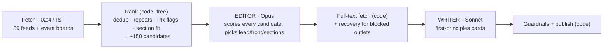

# The Daily Cactus — Handbook (v8, 24 Sep 2026)

The one document to open cold. Evidence and editorial reasoning live in
`EDITORIAL_STANDARDS.md`; the routines' short rules live in `CLAUDE.md`.
The GitHub repo `aman-beniwal/daily-cactus` is the source of truth — the
local folder on the Mac is an old partial copy; never push from it.

---

## 1. How the paper is made



- Only two steps use a model (editor, writer), each as ONE request on your
  Claude subscription — no agent loop, no laptop. Everything else is free code
  on GitHub Actions.
- ~49k tokens in / ~11k out per paper (measured on 23 Sep data).
- Until you switch to **live**, the new pipeline runs in **trial**: it writes to
  `trial/` and shows at `?trial=<date>`; your brother's routines keep
  publishing the real paper.

## 2. One-time setup (you)

1. **GitHub 2FA** — github.com → Settings → Password and authentication →
   enable two-factor authentication. This is the protection that matters most:
   the token can only be stolen by someone who controls your GitHub account.
2. **Secret scanning** — repo → Settings → Advanced Security (or "Code security")
   → make sure **Secret scanning** and **Push protection** are on. They block a
   key from ever being committed by mistake.
3. **Create the token** — in Terminal on your Mac, signed in to YOUR Claude account:
   ```bash
   claude setup-token
   ```
   Approve in the browser; the token prints once. Copy it. Paste it nowhere
   except step 4 (not in chat, not in a file).
4. **Store it** — repo → Settings → Secrets and variables → Actions →
   *New repository secret*: name `CLAUDE_CODE_OAUTH_TOKEN`, value = the token.
5. **Record the date** — same page, *Variables* tab → *New repository variable*:
   `TOKEN_SET_ON` = today's date (`2026-09-24`). Drives the expiry reminder.
6. **First test (optional, instead of waiting for tonight)** — Actions tab →
   "Newsroom — select & write (v8)" → *Run workflow* (leave inputs blank).
   Then open `https://aman-beniwal.github.io/daily-cactus/?trial=<today>`.

## 3. Daily operation

| When (IST) | What | Where to look |
|---|---|---|
| ~02:47 (GitHub may start it up to 2 h late) | Fetch + rank | Actions → "Fetch RSS Feeds" |
| right after | Newsroom (trial or live) | Actions → "Newsroom"; `?trial=<date>` |
| ~11:10 | Brother's routines publish the live paper (until you switch) | the site |
| 14:13 | Watchdog: is today's paper there? | Issues (you get an email) |

Everything that goes wrong opens a GitHub **Issue** labelled `health`, and
GitHub emails you. Issues are the dashboard.

**Compare for 3-5 days:** `…/daily-cactus/?date=<date>` (live) vs
`…/daily-cactus/?trial=<date>` (new). Judge: better picks? clearer writing?
Then ask Claude to read `feeds/newsroom_log.jsonl` for the real token numbers.

**Switch to live:** Variables → `NEWSROOM_MODE` = `live`; then pause the two
scheduled tasks on your brother's laptop. **Switch accounts later:** run step 3
on the other account, replace the secret, update `TOKEN_SET_ON`.

## 4. Security & the token

**What the token can do:** make model requests on your Claude plan. Nothing
else — no chats, history, memory, projects, connectors, files, email, GitHub.
Gbrain is safe: it runs at `127.0.0.1:3131`, an address that only exists
inside your Mac. **Worst case if leaked:** someone uses your allowance, under
your account. **Where it lives:** only in GitHub's encrypted secrets — hidden
in logs, never in a file, not available to outsiders even though the repo is
public.

**Why the repo is public:** GitHub Pages is free only for public repos (private
+ Pages needs GitHub Pro, ~$4/month). Public code ≠ public secrets. Nothing
secret has ever been committed (full-history scan, 24 Sep 2026).

**Alarms (all arrive as Issues → email):**
| Alarm | Fires when |
|---|---|
| GUARD: workflow files changed | any commit touches `.github/workflows/` — the way a secret gets stolen. If it wasn't you (or Claude with you), act now |
| ALERT: token rejected | the Claude call fails with an auth error (revoked/expired/wrong) |
| ALERT: usage spiked | a day's newsroom tokens > 2x the recent median (and > 90k) |
| Token expires in ~30 days | weekly check against `TOKEN_SET_ON` (token lasts 1 year) |
| Usage guard (no issue) | a runaway input is refused before it is sent (editor > ~40k tokens, writer > ~65k) |

**Only your own runs are visible to GitHub.** For the account as a whole,
glance at claude.ai → Settings → Usage once a week: if usage is much higher
than your own use + one paper a day, treat it as a leak.

**Rotate the token (5 minutes):**
1. claude.ai → Settings → revoke the old Claude Code token (if you can't find
   it, creating a new one and replacing the secret still cuts off the old
   pipeline use; revoking stops any other use).
2. `claude setup-token` → copy the new one.
3. Replace secret `CLAUDE_CODE_OAUTH_TOKEN`; update `TOKEN_SET_ON`.
4. If the GUARD alarm fired: also change your GitHub password and check
   Settings → Sessions for devices you don't recognise.

## 5. Settings you can change (repo Variables — no code)

| Variable | Default | Use |
|---|---|---|
| `NEWSROOM_MODE` | `trial` | `live` to publish from the new pipeline |
| `EDITOR_MODEL` | `claude-opus-5-5` | `claude-sonnet-5` to save allowance |
| `WRITER_MODEL` | `claude-sonnet-5` | |
| `EDITOR_EFFORT` / `WRITER_EFFORT` | `low` | `medium` for more reasoning (more tokens) |
| `TOKEN_SET_ON` | — | date the token was created |

## 6. Where things live

| Path | What |
|---|---|
| `sources.yaml` | the 89 feeds, per section; every cut documented inline |
| `scripts/build_digest.py`, `scripts/editorial.py` | ranking, repeats, PR/format/section-fit flags, opportunity scoring |
| `prompts/editor.md`, `prompts/writer.md` | the two model instructions (edit here — they're live) |
| `scripts/newsroom.py` | the editor → fetch → writer run, fallbacks, usage guard |
| `scripts/fetch_selected.py` | full text + recovery for blocked outlets |
| `scripts/assemble_edition.py` | guardrails + edition JSON (never rewrites a published date) |
| `site/` | the page (`?date=`, `?trial=`) |
| `.github/workflows/` | fetch · newsroom · publish · select (routines) · watchdog · guard · taste · audit |
| `feeds/newsroom_log.jsonl` | tokens per stage per day |

## 7. Standing decisions (don't relitigate)

- **Subscription only**, never an API key.
- **Never cap article text** to save tokens (tried; summaries got worse).
- **Fix extraction for hard sources**, don't drop them (Reuters/Bloomberg).
- **Published editions are immutable**; deploys only add files. Verify on a
  recent and the oldest (2026-06-18) edition before any renderer change.
- **24 full stories max**, breadth via one-line mentions (~15-minute read).
- **Writing standard:** first-principles clarity — fact → mechanism →
  consequence, a yardstick from the text for every number, jargon glossed once.
- **Selection:** code measures prominence; the editor scores Scale · Novelty ·
  Consequence · Fit; lead by head-to-head; code enforces the rules.
- **Sources:** ~3-5x each section's shortlist; no paywalled headline-only feeds.
- **Gemini free tier: no** (inputs used for training + human review; adds a
  failure point; saves little).

## 8. Status (24 Sep 2026)

**Done and live:** repeat filter restored; ranking v7 (section fit, PR flags,
event-date opportunities, learned source weights); text recovery for blocked
outlets; writing guardrails; watchdog; new sections (Economy & Markets, World &
Geopolitics, Work & Careers, Startups & Venture); 89 vetted feeds; v8 newsroom
in trial; first-principles writing; security hardening (validated inputs,
pinned CLI + deploy action); misuse alarms. 0 of 60 published editions changed.

**Your to-do:** section 2 steps 1-6; compare trial vs live 3-5 days; switch.
Optional: remove your name/Jaipur/career targets from the public prompts;
delete the old expired `GITHUB_TOKEN.local.md` in the local Mac folder.

**Not yet verified in production:** the first real `claude -p` run (needs your
token); tonight's fetch with the new source list.

**Known limits:** Reuters paywalled exclusives often stay headline-only (the
paper never leads with them); GitHub's scheduler can start jobs up to ~2 h late.
