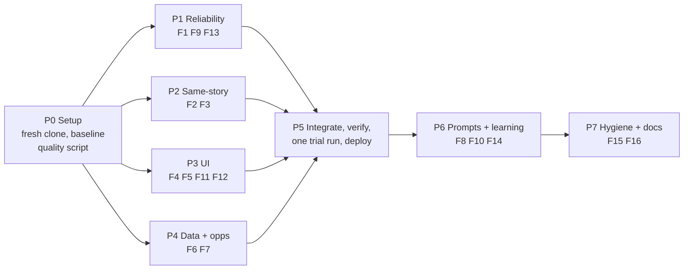

# Daily Cactus v9: audit fixes plan (5 Oct 2026)

Source: read-only audit of the 11 live papers (25 Sep to 5 Oct 2026), run logs,
issues, and the live site, plus Aman's two findings (text wrapping, same-story
duplicates). Work happens in a FRESH CLONE of `aman-beniwal/daily-cactus`
(this local folder is stale; never push from it). This file gets committed to
the repo as `docs/V9_PLAN.md` during Phase 0.

## Answer: is the lateness caused by the laptop sleeping?
No. Since v8, every step (fetch, editor, writer, publish) runs on GitHub's
servers, not on any laptop. The commit timestamps prove it: the jobs ran at
05:10 to 06:35 IST while laptops were asleep. The delay is GitHub's free
scheduler queue: scheduled jobs on a busy hour can start hours late. (The old
setup did depend on your brother's laptop; that is retired.) The paper still
lands by ~06:45 IST, so the real damage is to the WATCHDOG, which runs at
19:00 to 22:30 IST instead of 14:13 and so never warns you in time.

## All findings (ranked)

| # | Area | Problem | Evidence |
|---|---|---|---|
| F1 | Reliability | Usage-limit failure publishes a weak backup paper that can never be replaced, silently | 27 Sep: "session limit, resets 2:30am UTC" at 05:13 IST; no alert; watchdog green |
| F2 | Content | **Same story twice in one paper** (Aman's #2) | 13 same-day pairs in 11 papers; 29 Sep Nvidia agent-safety x3 (2 on front page); 27 Sep IIT Madras fund x3 |
| F3 | Content | Same story on consecutive days | 4 in 11 days (World Labs, pharma tariff, Apple Pay, IIT Madras fund) |
| F4 | UI | **Text wraps in wrong places** (Aman's #1) | Lead Signal + Editor's Read use `columns:2` (style.css ~line 200): one bullet fills only the left half; a paragraph splits mid-sentence. Plus ch-based caps (60-66ch) on hook/points/signal |
| F5 | UI | Raw `___` shows instead of an underline | app.js `_UL_RE` caps the phrase at 120 chars; 29 Sep lead phrase was ~130 |
| F6 | Data | **Market % changes are wrong** on many days | Nifty 23140.5 shown 26/27/28 Sep with -1.31 / +0.34 / +0.34; Brent -8.6% shown two days running. `fetch_markets.py` uses `closes[-2]`, which is two days back when today's candle is missing. No "as of" date shown |
| F7 | Content | Opportunities miss the brief | 46 listings: 0 Jaipur, 0 fellowships, 0 MBA, 0 NGO; college hackathons get through; repeats; mixed date formats |
| F8 | Learning | Votes never leave the device | `FEEDBACK_FORM = null`; TASTE.md auto-feedback empty since July |
| F9 | Ops | Watchdog fires 5 to 8 hours late; alerts only on auth errors | watchdog runs 18:50-22:30 IST; `newsroom.py` alerts on auth regex only |
| F10 | Content | Lead monoculture + forced India angle + predictions stated as fact | 7/11 leads US AI policy/labs; up to 11/24 signals mention India |
| F11 | UI | Mobile: masthead clipped, 8-line sticky nav, 7-row markets, "optimized for desktop" toast, hook hidden behind "Read more" | screenshots at 375px |
| F12 | Polish | Raw feed titles as source names; publisher logos used as photos; Guardian photos carry a logo overlay | "AI News & Artificial Intelligence \| TechCrunch"; The Hindu og-image x3 |
| F13 | Backup | Wire edition repeats headline, keeps scraped junk ("2-MIN READ2-MIN 1"), has exact duplicate cards, no opportunities | 27 Sep |
| F14 | Writing | Rare logic slips | "80% offshore, up from 80%" (30 Sep) |
| F15 | Hygiene | Docs out of date (repo CLAUDE.md = v6, local = v5), ~15 stale root docs, old `select.yml`, stale open issues, tests never run automatically, ~15 MB of feed data committed daily | repo |
| F16 | Cosmetic | "Edition No 112" while 72 editions exist | numbering = days since launch |

| F17 | Grounding | Writer moves facts between stories in the same paper, and occasionally adds facts from its own memory | ~92% of names in hook/points appear in that card's own article. Most of the rest come from ANOTHER article in the same day's input (e.g. "GPT-6.1 Astra" put into the "Trump rejects AI rules" card; NEURA/EU regulation in a FieldAI card came from a duplicate FieldAI article). A few came from model memory: "UPS (12,000 managers)" in the BMW card, "Germany's TKMS" in the fighter-jet card. No invented events found. |
| F18 | Models | Writer runs on the previous-generation `claude-sonnet-5`; CLI pinned to 2.1.280, which predates Sonnet 5.5 (released 28 Sep 2026) | `newsroom.py` defaults; `newsroom.yml` line 76 |

Verified fine: 628/649 card numbers appear in the source text (rest are sums or a second outlet's text); cost steady ~64k in / 16k out per paper; 10/11 papers AI-written.

## Phases

### P0. Setup and baseline (me)
1. Fresh clone; branch `v9`.
2. Write `scripts/quality_report.py` (code only, no model): for a date, count same-day duplicate pairs, cross-day repeats (last 7 days), numbers not found in source text, opportunities failing rules (past date, college event, outside India-online), market sanity (price unchanged but % changed). Run it on 25 Sep to 5 Oct: this is the BEFORE scorecard every phase is judged against.

### P1. Reliability (me: touches workflows + a standing decision)
1. `newsroom.py`: detect "session limit / rate limit / overloaded" errors, parse the reset time, wait and retry (cap: until ~10:30 IST) before falling back. Retry the writer alone when only it failed.
2. Alert (GitHub issue) on ANY fallback: editor fallback, wire edition, or retry used.
3. **Needs your OK:** allow a real AI paper to replace a same-day WIRE backup (badge `WIRE` only). Every other published edition stays immutable. Retry job: a second scheduled newsroom run that only acts if today's paper is a backup.
4. Watchdog: run it as the final step of the publish workflow (on time by construction), keep the cron as a backstop; also flag "paper is a backup".
5. Clean wire edition: no headline echo, strip boilerplate lines, dedupe ids, keep opportunities.
6. Note: editing `.github/workflows/` will trigger the GUARD alarm issue. Expected; I will tell you when.

### P2. Same story once (Sonnet agent A)
Layered, because no single check catches all rewordings:
1. **Before the editor** (`build_digest.py` / `editorial.py`): cluster candidates on a fingerprint of headline + teaser: proper nouns, numbers with units ("450 crore", "$8.2 billion"), and key nouns. Same entities + a shared number = same story. Keep the best-sourced item; record the others as `buzz`. Today it compares headline words only.
2. **Editor output**: add a short `storyline` label per pick (e.g. "nvidia-agent-safety"); `validate_selection` rejects a second pick with the same label or a near-identical fingerprint and promotes the next best.
3. **After the writer** (`assemble_edition.py`): final guard on hook + points fingerprints; drop the weaker duplicate, log a warning.
4. **Cross-day**: run the same fingerprint against the last 7 days of published cards (not only urls/titles). A repeat is allowed only with a genuinely new number or verdict, then shown as a one-line "Since yesterday" update instead of a full card.
5. Fallback path (`code_ranked_selection`) gets the same dedupe.
6. Acceptance: replay 25 Sep to 5 Oct digests/drafts: same-day pairs 13 -> 0 true duplicates, cross-day 4 -> 0, without dropping distinct stories (I hand-check every removal).

### P2b. Grounding and model choice (me; runs before P5's trial)
1. **Grounding check in code** (`assemble_edition.py` + `quality_report.py`): every number and proper noun in a card's hook/points must appear in that card's own source text (or in a duplicate article merged into it by P2). A failing point is logged for one week (flag-only), then automatically removed if the flag rate looks accurate. Signal and Editor's Read may interpret but may not add new names or numbers.
2. **Writer prompt:** "facts in a card come only from that card's article block"; facts from another story may appear only in signal/editors_read and must say so; predictions written as conditions ("if X, then Y"); check that no point contradicts itself.
3. **Model bake-off on real inputs** (one day's saved editor picks + article text, so only the writer is re-run): current `claude-sonnet-5` low vs `claude-sonnet-5-5` low vs `claude-sonnet-5-5` medium. Score each with `quality_report.py` (grounding, duplicates, length) plus my read of 5 cards each. Cost: ~3 writer runs, ~150k tokens total. Editor: test `claude-sonnet-5-5` medium against current `claude-opus-5-5` low on the same candidate list; switch only if lead + front-page picks match closely (Sonnet uses less of the weekly allowance, which also lowers the 27-Sep usage-limit risk).
4. Bump the pinned CLI from 2.1.280 to the newest reviewed version (official Anthropic npm package; read its changelog first) so it knows Sonnet 5.5. Then set `WRITER_MODEL` / `WRITER_EFFORT` (and `EDITOR_*` if the bake-off says so) as repo variables: no code change needed to switch back.

### P3. UI (Sonnet agent B; I verify in the browser)
1. Wrapping: remove `columns:2` from lead Signal and Editor's Read (single column, full width under the photo); replace the scattered ch caps with one readable measure rule; `text-wrap: balance` for headlines and kickers, `text-wrap: pretty` for body text (no single-word last lines); check headline breaks at 375 / 768 / 1280 / 1920 px.
2. Underline: renderer handles phrases of any length and strips unmatched `__`/`==` markers instead of printing them; assembler trims over-long underline phrases.
3. Mobile: masthead scales without clipping; nav = one horizontally scrolling row; markets = one scrolling line; remove the "optimized for desktop" toast; collapsed cards show the hook.
4. Source names: a display-name map in `sources.yaml` ("TechCrunch", "Livemint", "The Hindu"), applied in the assembler for new papers and in the renderer for old ones (`reuters.com` -> Reuters).
5. Photos: skip known placeholder/logo images (`og-image.png`, `/logo/`, site-default images); prefer the feed's own image over a branded og image.
6. Markets strip shows "as of <date, time>".
7. Gate (your #1 rule): render 2026-06-18 (legacy), 2026-09-27 (wire), 2026-09-29 (screenshot case) and 2026-10-05 at mobile and desktop before deploy. Bump `?v=`.

### P4. Data and opportunities (Sonnet agent C)
1. Markets: take the previous close from the quote's own metadata keyed by trading date, never `closes[-2]` blindly; store `as_of`; when the market was closed, show the last close with "closed" instead of a stale %. Validate against 3 instruments by hand.
2. Opportunities, code filters: drop college/student events (keywords: institute, college, university, IIT/NIT/BITS student fests, "students only", eDC), drop in-person outside Jaipur/Delhi-NCR unless online; normalise all dates to "Sat 10 Oct"; no repeat of a listing within 7 days.
3. Opportunities, new sources (vetted, RSS/structured only): fellowships (e.g. ProFellow, Opportunity Desk, Youth Opportunities filtered to policy/climate/AI governance), Jaipur (Luma Jaipur, Meetup Jaipur, ALT EFF), MBA (admissions event pages of Booth, Kellogg, Sloan, Columbia for India), volunteering (iVolunteer, Catalyst 2030 / NGOBox). Each source checked for a working feed before it is added.
4. Acceptance: a dry run over the last 7 days produces at least 1 fellowship and 1 Jaipur-or-online listing, 0 college events.

### P5. Integrate, verify, deploy (me)
1. Merge A/B/C branches into `v9`, run `tests/test_pipeline.py` + `quality_report.py` (AFTER scorecard vs BEFORE).
2. One trial newsroom run (`mode=trial`, ~80k tokens, publishes only to `?trial=`), compare with today's live paper.
3. Push to main, watch Publish, confirm editions count unchanged and old papers render.

### P6. Prompts and learning loop (me, small edits)
1. Writer: India angle only when the article supports it, otherwise a general consequence; predictions phrased as conditions ("if X, then Y") not certainties; a self-check line for contradictory numbers (F14).
2. Editor: no more than 2 consecutive days led by the same storyline family unless it materially moved; front page max 3 stories from one topic family.
3. Votes: a Google Form (you create it, 5 min, steps provided) -> `FEEDBACK_FORM` filled -> `taste.yml` reads the form's response sheet weekly. Privacy: the form is public, but it only receives story ids and up/down.
4. `quality_report.py` runs daily after publish; opens an issue only when a threshold breaks.

### P7. Hygiene and docs (me; nothing deleted without your OK)
1. Update repo `CLAUDE.md`, `HANDBOOK.md` (status, decisions, laptop-not-involved note), local `START_HERE.md`.
2. Move stale docs to `docs/archive/` (move, not delete); retire `select.yml` (old laptop routines); close stale issues with a note.
3. Run tests on every push (small CI job).
4. Stop committing the 10+ MB `feeds/latest.json` each day (keep it as a workflow artifact instead).
5. Edition number: label it "Day 112" or count real editions (your call, cosmetic).

## Later (separate decision, not in v9)
"Since yesterday" story threads as a feature, a 07:00 email with the lead, a weekly review page, archive search.

## Who does what
- **Me (Opus):** P0, P1, P5, P6, P7, plus reviewing every agent diff. These are small in code but carry the risk: workflows, the immutability rule, deploy, prompts.
- **3 Sonnet agents in parallel (P2, P3, P4):** each in its own fresh clone and branch, each with a written brief from this file and a measurable acceptance test. They do the bulk coding and replay testing; they never push.
- Why: the bulk code (dedupe clustering, CSS, scrapers) is where most tokens go and Sonnet handles it well with a tight brief; judgment and anything that can break the live paper stays with the reviewer.

## Decisions (Aman, 5 Oct 2026)
1. **No backup papers.** If the editor or writer can't run (usage limit, outage), retry until ~10:30 IST; if it still fails, publish NOTHING for that day and open an alert issue. The wire-edition fallback is removed from the live path. Replacing a published paper stays manual. Delete the existing false publish 2026-09-27 (wire edition) from gh-pages + the index (approved).
2. **Votes: no Google Form.** The page's "send to GitHub" button works (issue #27, 6 votes, 5 Oct). Fix `fold_taste.py` + `taste.yml` to read these "feedback batch" issues (JSON in the body), and make the vote bar remind when unsent votes pile up.
3. **Tidy-up approved:** move stale docs to `docs/archive/`, retire `select.yml`, close stale issues with a note.
4. **Model bake-off approved** (~150k tokens).
